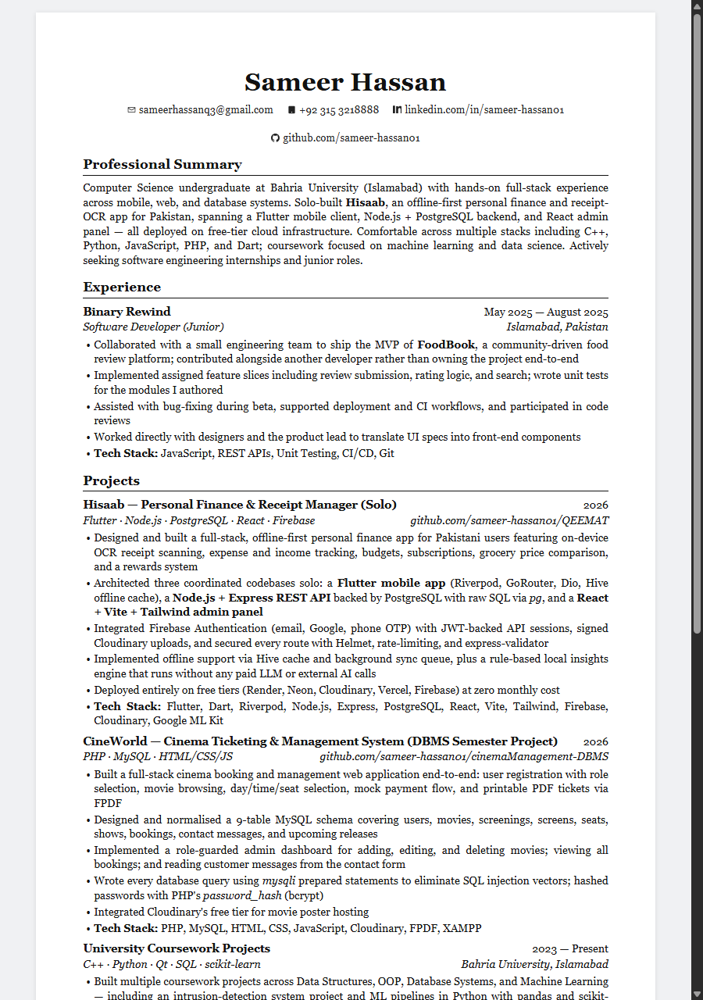

# Sameer Hassan — Curriculum Vitae

My CV, typeset in LaTeX. The compiled PDF is included; the source is here so it stays version-controlled and easy to update.

📄 **[Download the latest PDF](Sameer_Hassan_CV.pdf)**

## Preview



## Contents

| File | Description |
|------|-------------|
| `Sameer_Hassan_CV.tex` | LaTeX source |
| `Sameer_Hassan_CV.pdf` | Compiled CV (2 pages) |
| `cv-preview.png` | Preview image used above |
| `make-pdf.bat` | One-click build script (Windows) |

## Building from source

Requires a LaTeX distribution (e.g. [MiKTeX](https://miktex.org/) or TeX Live) with the
`fontawesome5`, `hyperref`, and `enumitem` packages.

```bash
pdflatex Sameer_Hassan_CV.tex
```

On Windows you can also just run `make-pdf.bat`.

## Contact

- **Email:** sameerhassanq3@gmail.com
- **LinkedIn:** [linkedin.com/in/sameer-hassan-a9420a262](https://linkedin.com/in/sameer-hassan-a9420a262)
- **GitHub:** [github.com/sameer-hassan01](https://github.com/sameer-hassan01)
